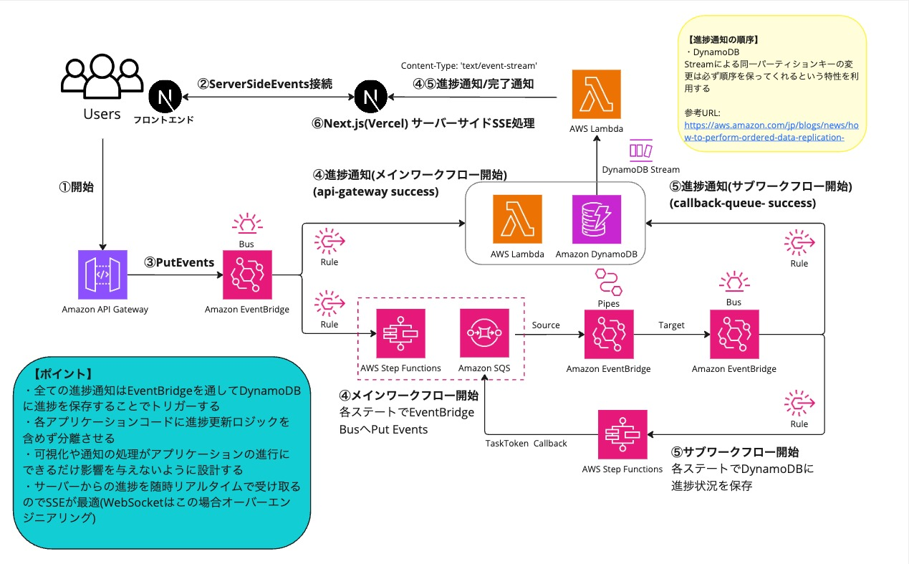

# 嘘論文生成アプリケーション(フロントエンド)

## 参考ドキュメント
- [Miro 構想資料](https://miro.com/app/board/uXjVLuyj9ss=/?share_link_id=568802384893)
- [サーバーサイド・インフラのリポジトリ](https://github.com/y-kawasaki/workflow-server)

## はじめに

本プロジェクトは、転職活動用に用意したAIを活用した嘘論文生成プロセスを可視化・制御するためのフロントエンドに関する機能リポジトリです。

運用・監視・保守を考慮したアプリの構想 →　アーキテクチャ設計 → 開発・実装能力 → デプロイ

まで一貫した能力があることを表現するために作成しましたので、もしよろしければ構想段階の資料とサーバーサイド・インフラのリポジトリも合わせてご覧くださいませ。

## プロジェクトの目的
サーバーレスアーキテクチャで構築されたバックエンドと連携し、以下の機能を提供。
- **ユーザーが入力したタイトルとカテゴリからユーモアのある嘘の内容の論文を生成AIを活用して作成する**
- **生成プロセスの可視化**: Step Functionsの実行状態をリアルタイムに表示
- **進捗管理**: 各ステップの実行状況をリアルタイムに監視
- **パフォーマンス分析**: 実行時間やリソース使用状況の可視化
- **マルチプレーヤーカーソルの表示**: 複数ユーザーでの同時閲覧感を出力(おまけ)

## 技術的なハイライト

### 1. リアルタイム通信の最適化
- **SSEによる効率的な進捗監視**
  - 軽量な単方向通信による状態更新
  - 再接続ロジックによる安定性確保
  - バックエンドからのプッシュ通知

- **状態管理の工夫**
  - Zustandによる効率的な状態管理
  - useSWRを活用したデータフェッチ
  - 不要な再レンダリングの防止

### 2. 直感的なUI/UX
- **ReactFlowによるワークフロー表現**
  - カスタムノード・エッジの実装
  - 状態に応じたオリジナルアニメーション
  - 進行状態を伝えるプログレスバーの表示

- **リアルタイムコラボレーション**
  - マルチプレーヤーカーソル同期
  - LiveblocksによるWebSocketの制御
  - プレゼンス管理

### 3. 堅牢なアーキテクチャ
- **Next.js 14の活用**
  - App Routerの採用
  - サーバーコンポーネントの活用(ServerActions)
  - 最適化されたビルド

- **型安全性の徹底**
  - TypeScriptによる静的型チェック
  - APIレスポンスの型定義
  - エラーハンドリングの強化

## システムアーキテクチャ

本リポジトリは、下図のフロントエンド部分（Next.jsサーバー(on Vercel)）を実装しています。
バックエンドとの通信を担い、ユーザーインターフェースを提供します。



### SSE進捗通知システム

Server-Sent Events (SSE)を活用して、ワークフローの進捗状態をリアルタイムに更新する仕組みを実装しています。

1. **SSEClientの実装(クラス)**
  ```typescript
   // src/lib/sse/SSEClient.ts
   export default class SSEClient {
    // 静的プロパティ：クライアントのデータを格納
    private static clients: Map<string, Client[]> = new Map();

    // クライアントを追加
    static addClient(workflowId: string, controller: ReadableStreamDefaultController): void {
      const currentClients = this.clients.get(workflowId) || [];
      currentClients.push({ workflowId, controller });
      this.clients.set(workflowId, currentClients);
      console.log(`Client added for workflow: ${workflowId}, Total clients: ${currentClients.length}`);
    }

    // クライアントを削除
    static removeClient(workflowId: string, controller: ReadableStreamDefaultController): void {
      const currentClients = this.clients.get(workflowId);
      if (!currentClients) return;

      const updatedClients = currentClients.filter(client => client.controller !== controller);
      if (updatedClients.length === 0) {
        this.clients.delete(workflowId);
      } else {
        this.clients.set(workflowId, updatedClients);
      }
      console.log(`Client removed for workflow: ${workflowId}, Remaining clients: ${updatedClients.length}`);
    }

    // 指定されたworkflowIdのクライアントにデータを送信
    static broadcastToWorkflow(workflowId: string, data: ProgressData): void {
      const currentClients = this.clients.get(workflowId);

      console.log(`Broadcasting to workflow ${workflowId}, Active clients:`, 
        currentClients?.length || 0
      );

      if (!currentClients || currentClients.length === 0) {
        console.warn(`No active clients found for workflow: ${workflowId}`);
        return;
      }

      const message = `data: ${JSON.stringify(data)}\n\n`;
      const encoded = new TextEncoder().encode(message);

      const failedClients: number[] = [];
      currentClients.forEach((client, index) => {
        try {
          client.controller.enqueue(encoded);
          console.log(`Message sent to client for workflow: ${workflowId}`);
        } catch (error) {
          console.error(`Failed to send message to client for workflow: ${workflowId}`, error);
          failedClients.push(index);
        }
      });

      // 失敗したクライアントを除去
      if (failedClients.length > 0) {
        const validClients = currentClients.filter((_, index) => !failedClients.includes(index));
        if (validClients.length === 0) {
          this.clients.delete(workflowId);
        } else {
          this.clients.set(workflowId, validClients);
        }
      }
    }

    // アクティブなクライアント数を取得
    static getActiveClientsCount(workflowId: string): number {
      return this.clients.get(workflowId)?.length || 0;
    }
  }
   
  ```

2. **進捗状態の管理(Zustand)**
  ```typescript
  // src/features/workflow/stores/useProgressStore.ts
  export const useProgressStore = create<ProgressStore>((set, get) => ({
    progressBar: {
      percentage: 0,
      status: 'PROCESSING'
    },
    updateProgress: (percentage, status) => {
      set({ progressBar: { percentage, status } });
      
      if ((status === 'SUCCESS' && percentage === 100) || status === 'FAILED') {
        get().onProgressComplete?.(status);
      }
    },
    resetProgress: () => set({
      progressBar: { percentage: 0, status: 'PROCESSING' }
    }),
    onProgressComplete: undefined,
    setOnProgressComplete: (callback) => set({ 
      onProgressComplete: callback 
    })
  })); 
  ```

3. **UIコンポーネントとの連携(カスタムフック)**
  ```typescript
   // src/features/workflow/hooks/useWorkflowProgress.ts
   export const useWorkflowProgress = (workflowId: string) => {
     const sseManager = useMemo(() => new SSEClient(), []);
     const updateProgress = useProgressStore((state) => state.updateProgress);
     
     useEffect(() => {
       sseManager.connect(workflowId);
       return () => sseManager.disconnect();
     }, [workflowId]);
   };
  ```

## プロジェクト構造

本プロジェクトは、以下のような独自のモジュール分割アプローチで設計されています：

```
src/
├── features/          # 機能モジュール
│   ├── workflow/      # メイン機能：ワークフロー管理
│   │   ├── components/  # 機能固有のコンポーネント
│   │   │   ├── WorkflowVisualizer/  # ワークフロー表示
│   │   │   ├── TracesDashboard/     # トレース情報
│   │   │   └── WorkflowHistories/   # 実行履歴
│   │   ├── hooks/      # カスタムフック
│   │   ├── stores/     # 状態管理
│   │   ├── services/   # APIサービス
│   │   └── types/      # 型定義
│   └── room/         # マルチプレーヤーカーソルに関する機能
├── components/        # 共通コンポーネント
│   ├── ui-mass/      # 複合コンポーネント
│   └── ui-parts/     # 基本コンポーネント
├── lib/              # 共通ユーティリティ
└── styles/           # グローバルスタイル
```

### モジュール構成の特徴

1. **機能ベースの分割**
   - メイン機能とサポート機能の明確な分離
   - 機能ごとの完全な独立性
   - 依存関係の最小化

2. **コンポーネント階層**
   - 複合/基本コンポーネントの明確な分離
   - 再利用性を考慮した設計
   - 責務の明確な定義

3. **共通基盤**
   - 通信機能の集約
   - ユーティリティの共有
   - スタイルの一元管理

## 技術スタック

### フロントエンド基盤
- **Next.js 14**: Reactフレームワーク
- **TypeScript**: 静的型付け
- **TailwindCSS**: スタイリング
- **SCSS Modules**: コンポーネント別スタイリング

### 状態管理・データフェッチ
- **ServerActions**: サーバーサイドでのデータ取得
- **Zustand**: 軽量な状態管理
- **useSWR**: データフェッチング

### UI/UXライブラリ
- **ReactFlow**: ワークフローの可視化
- **Liveblocks**: リアルタイムコラボレーション

### 開発ツール
- **ESLint**: コード品質管理
- **Prettier**: コードフォーマット
- **PostCSS**: CSSの最適化

## セットアップガイド

### 開発環境のセットアップ
```bash
# パッケージのインストール
npm install

# 開発サーバーの起動
npm run dev
```

### 環境変数の設定

`.env`ファイルを作成し、必要な環境変数を設定してください。詳細は`.env.sample`を参照してください。
