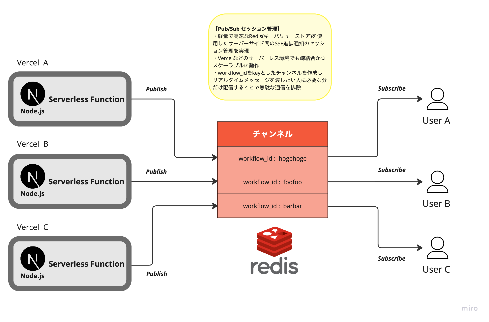

# 嘘論文生成アプリケーション(フロントエンド)

## 参考ドキュメント
- <a href="https://miro.com/app/board/uXjVLuyj9ss=/?share_link_id=568802384893" target="_blank" rel="noopener noreferrer">Miro 構想資料</a>
- <a href="https://github.com/haruki-0408/melon" target="_blank" rel="noopener noreferrer">サーバーサイド・インフラリポジトリ</a>

## はじめに

本プロジェクトは、転職活動用に用意したAIを活用した嘘論文生成プロセスを可視化・制御するためのフロントエンドに関する機能リポジトリです。

運用・監視・保守を考慮したアプリの構想 →　アーキテクチャ設計 → 開発・実装能力 → デプロイ

まで一貫した能力があることを表現するために作成しましたので、もしよろしければ<a href="https://miro.com/app/board/uXjVLuyj9ss=/?share_link_id=568802384893" target="_blank" rel="noopener noreferrer">構想資料</a>と<a href="https://github.com/haruki-0408/melon" target="_blank" rel="noopener noreferrer">サーバーサイド・インフラ</a>のリポジトリも合わせてご覧くださいませ。

## アプリケーションページ
ぜひお気軽にお試しください！

<a href="https://orange-webp.vercel.app/" target="_blank" rel="noopener noreferrer">嘘論文生成アプリケーション(FakeThesisGenerator)</a>


## プロジェクトの目的
サーバーレスアーキテクチャで構築されたバックエンドと連携し、以下の機能を提供。
- **ユーモアのある嘘論文の生成**: ユーザーが入力したタイトルとカテゴリからユーモアのある嘘の内容の論文を生成AIを活用して作成しPDF形式でダウンロードできる

- **生成プロセスの可視化**: Redisを用いたSSE接続とReactFlowを活用してStep Functionsの実行状態をリアルタイムに表示
- **パフォーマンス分析**: X-ray, Cloudwatch Logsを用いて実行時間やリソース使用状況など全体のログ・モニタリングの可視化できる
- **マルチプレーヤーカーソルの表示**: 複数ユーザーでの同時閲覧感を出力(おまけ)

## 技術的なハイライト

### 1. リアルタイム通信の最適化
- **SSEによる効率的な進捗監視**
  - 軽量な単方向通信による状態更新
  - Redis Pub/Subによるスケーラブルな通知
  - 再接続ロジックによる安定性確保
  - バックエンドからのプッシュ通知

- **状態管理の工夫**
  - Zustandによる効率的な状態管理
  - useSWRを活用したデータフェッチ
  - 不要な再レンダリングの防止

### 2. 直感的なUI/UX
- **ReactFlowによるワークフロー表現**
  - カスタムノード・エッジの実装
  - 状態に応じたオリジナルアニメーション
  - 進行状態を伝えるプログレスバーの表示

- **モニタリングパフォーマンス測定**
  - X-ray, Cloudwatch Logsを用いて実行時間やリソース使用状況など全体のログ・モニタリングの可視化できる
  - マルチプレーヤーカーソル同期
  - LiveblocksによるWebSocketの制御
  - プレゼンス管理

### 3. 堅牢なアーキテクチャ
- **Next.js 14の活用**
  - App Routerの採用
  - サーバーコンポーネントの活用(ServerActions)
  - 最適化されたビルド

- **型安全性の徹底**
  - TypeScriptによる静的型チェック
  - APIレスポンスの型定義
  - エラーハンドリングの強化

## システムアーキテクチャ

本リポジトリは、下図のフロントエンド部分（Next.jsサーバー(on Vercel)）を実装しています。
バックエンドとの通信を担い、ユーザーインターフェースを提供します。


### SSE進捗通知システム

このプロジェクトは、Server-Sent Events (SSE)を活用して、ワークフローの進捗をリアルタイムで管理・可視化するための高スケーラブルなアーキテクチャを示しています。以下に主要技術とその役割を説明します。


主要機能と技術

### 1. ▼ Next.js App Router

動的APIルート: Next.jsの動的ルーティング機能を活用し、ワークフロー進捗の更新やServer-Sent Events（SSE）接続のAPIリクエストを処理します。

Node.jsランタイム: サーバーサイドレンダリングとNode.jsランタイムを活用し、低遅延で高い応答性を実現します。

### 2. 👀 リアルタイム更新のためのServer-Sent Events (SSE)

SSEストリーム: クライアントとの長時間接続を確立し、リアルタイムの進捗更新をプッシュします。ReadableStreamを使用してフロントエンドとシームレスに統合。

イベント処理: 接続初期化、メッセージ処理、切断時のクリーンアップなど、クライアントライフサイクルを管理します。

ユースケース: ワークフロー実行の進捗監視など、リアルタイムフィードバックが必要なシナリオに最適です。

### 3. 🚨 Redis Pub/Subによるスケーラブルな通知



Redis Pub/Subメカニズム: Redisを使用して、メッセージの発行と購読を行い、効率的に進捗更新を配信します。

マルチクライアント対応: イベントプロデューサー（バックエンド）とイベントコンシューマー（SSEクライアント）を分離し、スケーラビリティを確保。Vercelなどのサーバーレス環境でも利用可能なようにコンポーネントの分離を意識しています。

実装ハイライト:

発行: ワークフロー進捗の更新をRedisチャンネルに発行。

購読: バックエンドがRedisチャンネルを購読し、SSEを介して接続クライアントに更新を配信。

### 4. ⛅️　Zustandによる状態管理

グローバル状態管理: Zustandを使用して、クライアントサイドのSSE接続状態とアクティブなワークフローを管理。

簡素化された統合: SSE接続の初期化や終了を簡単に行えるメソッドを提供し、複雑さを隠蔽。

### ワークフローアーキテクチャ

ワークフロー実行:

ユーザーがワークフローを開始するとトリガーされます。

クライアントはリアルタイム進捗の受信のために/api/sse/[workflow_id]に接続します。

通知フロー:

ワークフローの進捗データは、Lambdaなどからバックエンドの/api/notifyエンドポイントに送信されます。

バックエンドは進捗更新をRedisチャンネルに発行します。

リアルタイム可視化:

購読しているSSEクライアントがこれらの更新をリアルタイムで受信します。

更新が動的に表示され、ユーザーは即座にワークフローの進捗を把握できます。

コードハイライト
Redis Pub/Sub統合を管理し、リアルタイムデータ配信を実現。

```typescript
// /lib/sse/SSEClient.ts
static async subscribeRedis(workflowId: string, controller: ReadableStreamDefaultController): Promise<void> {
  this.redisSubscribe.subscribe(workflowId, (error) => {
    if (error) {
      console.error('Failed to subscribe:', error);
    }
  });

  this.redisSubscribe.on('message', (channel, message) => {
    controller.enqueue(new TextEncoder().encode(`data: ${message}\n\n`));
  });
}

static async publishProgress(workflowId: string, data: ProgressData): Promise<void> {
  await this.redisPublish.publish(workflowId, JSON.stringify(data));
}
```

クライアント接続を確立し管理するSSE APIルートを定義。
```typescript
// /app/api/sse/[workflow_id]/route.ts

export async function GET(req: NextRequest, { params }: { params: { workflow_id: string } }) {
  const { workflow_id } = params;

  const stream = new ReadableStream({
    start(controller) {
      SSEClient.subscribeRedis(workflow_id, controller);
      req.signal.addEventListener('abort', () => {
        SSEClient.unsubscribeRedis(workflow_id);
      });
    },
  });

  return new Response(stream, {
    headers: {
      'Content-Type': 'text/event-stream',
      'Cache-Control': 'no-cache',
      'Connection': 'keep-alive',
    },
  });
}
```


ワークフロー進捗更新を発行するためのAPIエンドポイント。
```typescript
// /app/api/notify/route.ts

export async function POST(req: NextRequest) {
  try {
    const json = await req.json();
    const { workflow_id, status, state_name } = json;

    const progress: ProgressData = {
      execution_id: json.execution_id,
      status,
      state_name,
      timestamp: new Date().toISOString(),
    };

    await SSEClient.publishProgress(workflow_id, progress);
    return NextResponse.json({ status: 'ok' });
  } catch (error) {
    console.error('Error in /api/notify:', error);
    return NextResponse.json({ error: 'Internal Server Error' }, { status: 500 });
  }
} 
```

このアーキテクチャの優位性

スケーラビリティ: Redis Pub/Subにより、多数のクライアントとワークフローを同時に処理可能。

効率性: SSEはリアルタイム更新に最適な軽量な仕組みであり、サーバーとネットワークの負荷を最小化。

開発者体験: Next.js App RouterとZustandの統合により、バックエンドとフロントエンド開発の効率化を実現。

これらの技術の強みを活用することで、リアルタイムなワークフロー管理と可視化を実現する堅牢で応答性の高いシステムを構築しています。

## プロジェクト構造

本プロジェクトは、以下のような独自のモジュール分割アプローチで設計されています：

```
src/
├── features/          # 機能モジュール
│   ├── workflow/      # メイン機能：ワークフロー管理
│   │   ├── components/  # 機能固有のコンポーネント
│   │   │   ├── WorkflowVisualizer/  # ワークフロー表示
│   │   │   ├── TracesDashboard/     # トレース情報
│   │   │   └── WorkflowHistories/   # 実行履歴
│   │   ├── hooks/      # カスタムフック
│   │   ├── stores/     # 状態管理
│   │   ├── services/   # APIサービス
│   │   └── types/      # 型定義
│   └── room/         # マルチプレーヤーカーソルに関する機能
├── components/        # 共通コンポーネント
│   ├── ui-mass/      # 複合コンポーネント
│   └── ui-parts/     # 基本コンポーネント
├── lib/              # 共通ユーティリティ
└── styles/           # グローバルスタイル
```

### モジュール構成の特徴

1. **機能ベースの分割**
   - メイン機能とサポート機能の明確な分離
   - 機能ごとの完全な独立性
   - 依存関係の最小化

2. **コンポーネント階層**
   - 複合/基本コンポーネントの明確な分離
   - 再利用性を考慮した設計
   - 責務の明確な定義

3. **共通基盤**
   - 通信機能の集約
   - ユーティリティの共有
   - スタイルの一元管理

## 技術スタック

### フロントエンド基盤
- **Next.js 14**: Reactフレームワーク
- **TypeScript**: 静的型付け
- **TailwindCSS**: スタイリング
- **SCSS Modules**: コンポーネント別スタイリング

### SSE接続管理
- **Redis**: Pub/Subによるスケーラブルな通知

### 状態管理・データフェッチ
- **ServerActions**: サーバーサイドでのデータ取得
- **Zustand**: 軽量な状態管理
- **useSWR**: データフェッチング

### UI/UXライブラリ
- **ReactFlow**: ワークフローの可視化
- **Liveblocks**: リアルタイムコラボレーション

### 開発ツール
- **ESLint**: コード品質管理
- **Prettier**: コードフォーマット
- **PostCSS**: CSSの最適化

## セットアップガイド

### 環境変数の設定

`.env`ファイルを作成し、必要な環境変数を設定してください。詳細は`.env.sample`を参照してください。

### 開発環境のセットアップ
```bash
# パッケージのインストール
npm install

# 開発サーバーの起動
npm run dev
```


